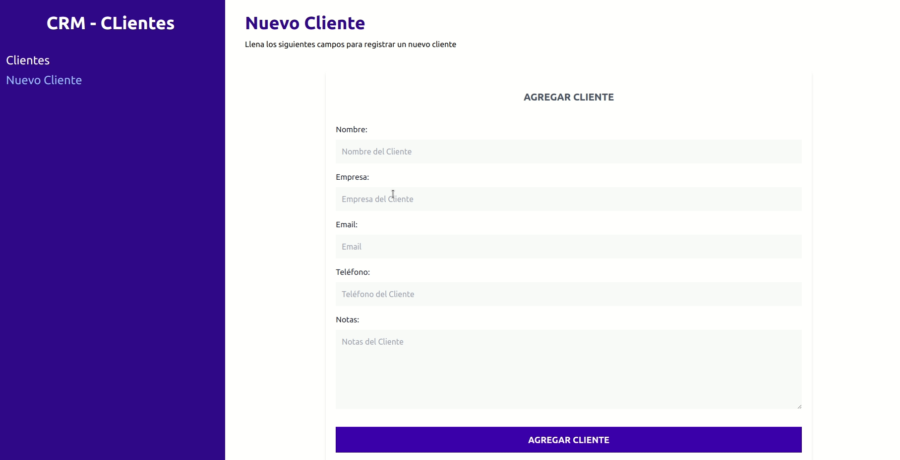

# App de CRM Clientes

App elaborada con la librería React, utilizando la herramienta VITE. La aplicación utiliza los principales hooks que brinda React y librerías externas como TaiwlindCSS y JSON-Server para brindar soporte en el almacenamiento de los datos. La app se sincroniza con la API my-json-server una vez la app sea deployada y enviada a produccion.
La app en cuestión permite brindar al usuario una herramienta para almacenar clientes con sus principales datos como nombre, empresa, telefono, email y notas; brindado una vez ésto suceda poder consultarlos, editarlos y eliminarnos a gusto. El formulario de creación como edición de los clientes cuenta con validaciones para cada campo, brindada por la librerías Fornik y Yup.

## Video Demo

## Ejecutando este Proyecto

1. Abre la terminal de Git
2. Cambia el directorio de trabajo actual a la ubicación en donde quieres clonar el directorio.
   `cd proyecto`

3. Escribe git clone seguido de la [URL](https://github.com/emanuelheredia/CRM-Clientes) del proyecto

`git clone https://github.com/emanuelheredia/CRM-Clientes `

4. Presiona Enter para crear tu clon local

    > $ git clone https://github.com/YOUR-USERNAME/YOUR-REPOSITORY
    > Cloning into `Spoon-Knife`...
    > remote: Counting objects: 10, done.
    > remote: Compressing objects: 100% (8/8), done.
    > remove: Total 10 (delta 1), reused 10 (delta 1)
    > Unpacking objects: 100% (10/10), done.

5. Instalar todas las dependencias necesarias dentro del directorio del proyecto
   `npm install`

6. Por último inicia el proyecto con npm start donde se iniciará el dashboard de expo en el navegador
   `npm start`

# Mis Redes :

-   [GITHUB](https://github.com/emanuelheredia)
-   [LINKEDIN](https://www.linkedin.com/in/emanuel-heredia-41749421a/)
